# 🍔 MunchY - Food Ordering Platform

MunchY is a full-stack food ordering platform where users can explore menu items, customize orders, manage profiles, and place online food orders with secure payments.

## 🌐 Live Demo

https://munch-y.vercel.app/

---

## Features

### ✨ User Features

- User registration and login
- Browse recently added food items
- Explore menu by categories
- Add customizable items to cart
- Size and extra ingredient selection
- Cart and checkout system
- Autofilled delivery details from profile
- Razorpay payment integration
- Order history tracking
- Profile management and editing
- About and Contact pages
- Responsive design across devices

---

### 🛠️ Admin Features

- Admin authentication
- Create, edit, and delete categories
- Create, edit, and delete menu items
- Upload food images
- Manage orders
- Update order statuses
- View all customer orders

---

## 🚀 Tech Stack

### Frontend
- Next.js
- React.js
- Tailwind CSS
- TypeScript

### Backend
- Next.js API Routes
- MongoDB
- Mongoose
- NextAuth
- JWT Authentication
- bcrypt
- Razorpay
- Cloudinary

---

## 🔑 Admin Credentials

```bash
Email: ayeshansari124@gmail.com
Password: ayesha
```

---

# 📸 Screenshots

## 👤 User Side

### 🏠 Homepage
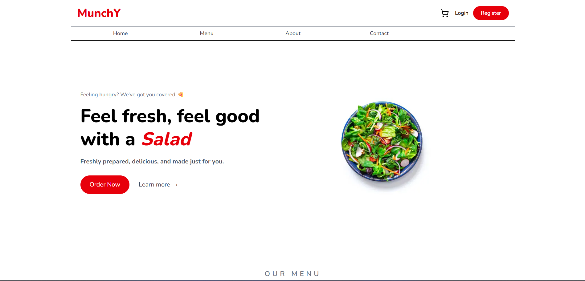

---

### 🆕 Recently Added Items
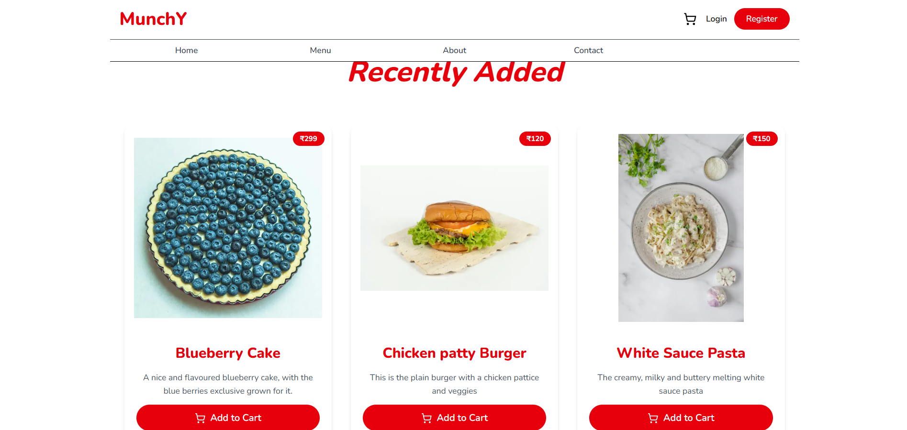

---

### 🍽️ Menu Categories
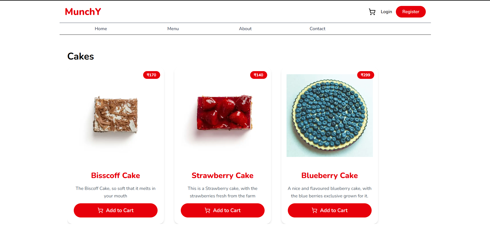

---

### 🔐 Authentication
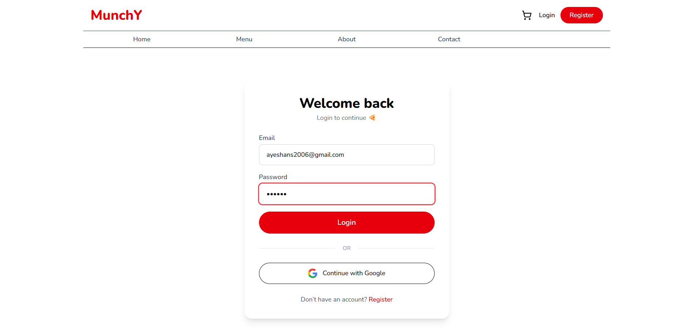

---

### 🍔 Product Customization
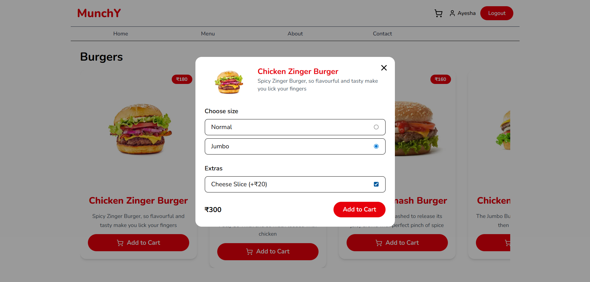

---

### 🍝 Extra Ingredients & Sizes
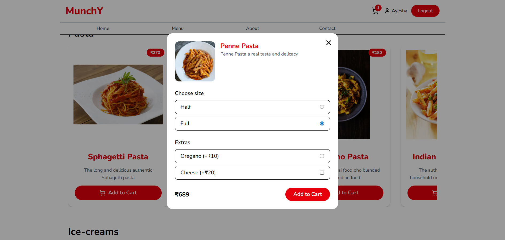

---

### 🛒 Cart & Checkout
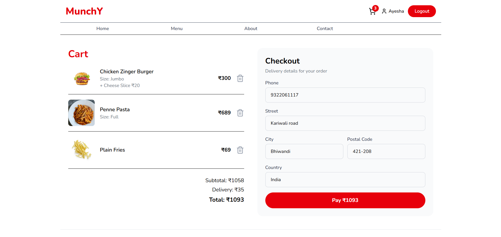

---

### 💳 Razorpay Payment
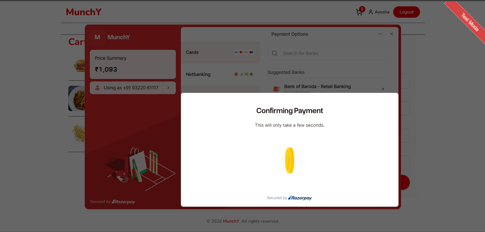

---

### 👤 Profile Management
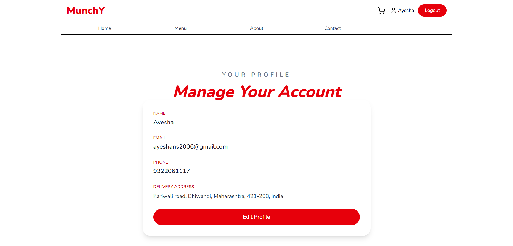

---

### ✏️ Edit Profile
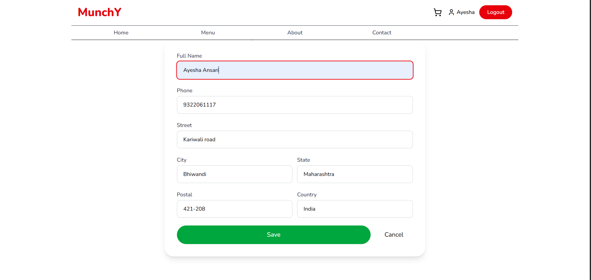

---

### 📦 Order History
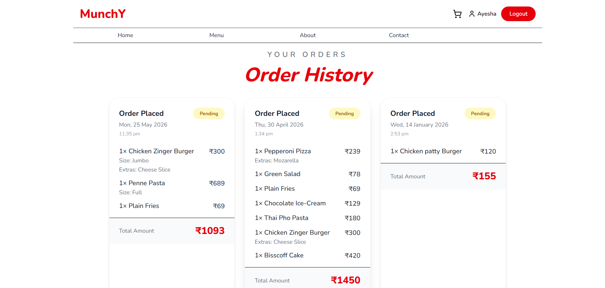

---

### ℹ️ About Page
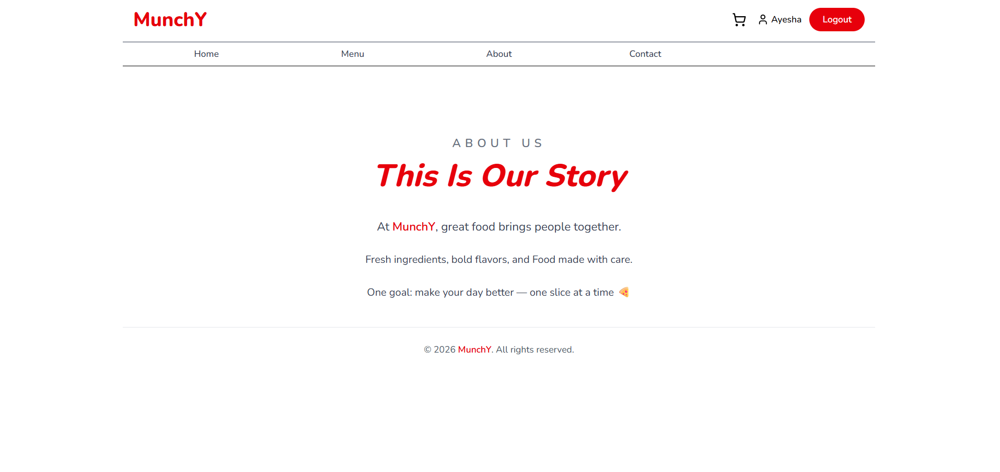

---

### 📞 Contact Page
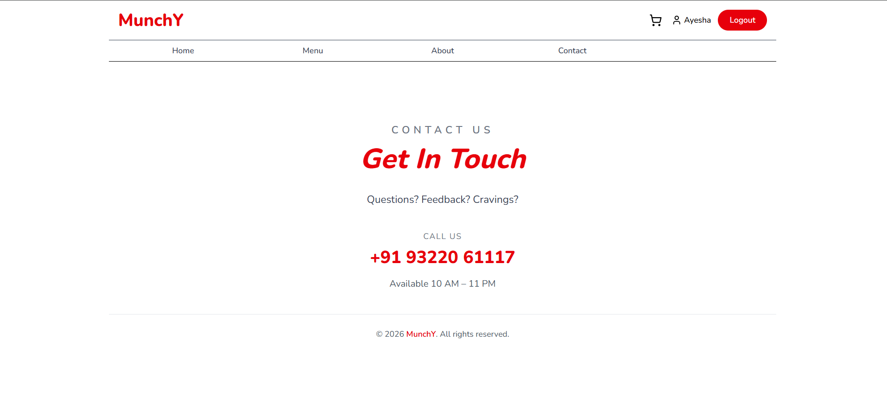

---

## 🛠️ Admin Side

### 📂 Category Management
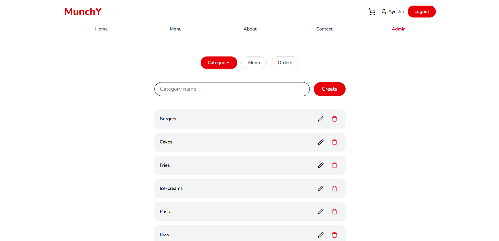

---

### ➕ Create Menu Items
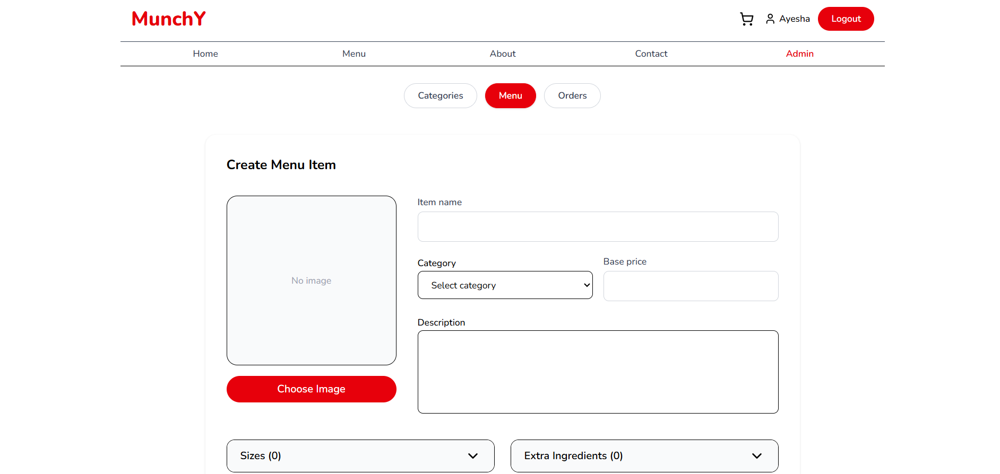

---

### ✏️ Manage Menu Items
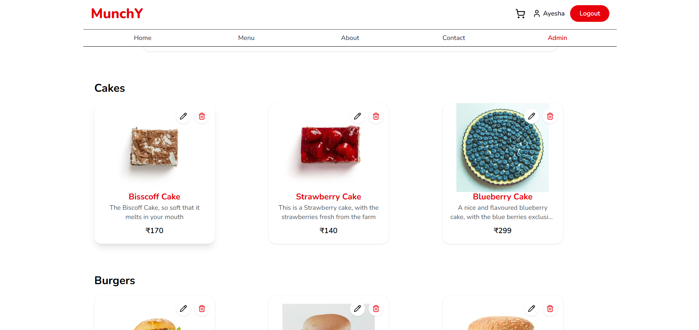

---

### 📦 Order Management
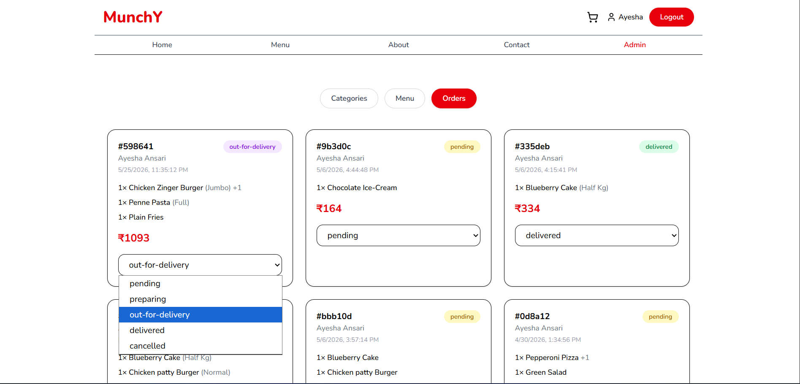

---

## 🧠 What I Learned

- Authentication with NextAuth
- Razorpay payment workflows
- Cart and checkout systems
- Dynamic food customization logic
- MongoDB schema design
- Admin dashboard workflows
- Cloudinary image handling
- Building scalable Next.js applications
- API route handling
- State and profile management

---

## 💡 Future Improvements

- Live order tracking
- Coupon system
- Reviews and ratings
- Favorite items
- Real-time notifications
- Delivery partner integration
- AI food recommendations

---

## 👩‍💻 Author

**Ayesha Ansari**

Built with ❤️ using Next.js, MongoDB, Tailwind CSS, and Razorpay